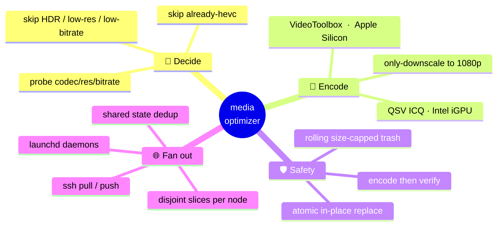
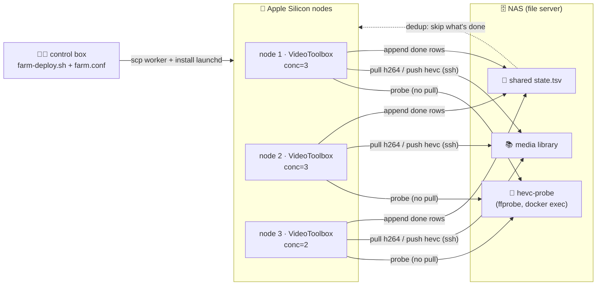
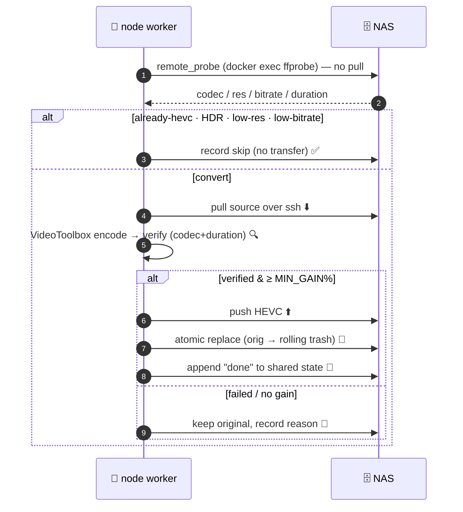
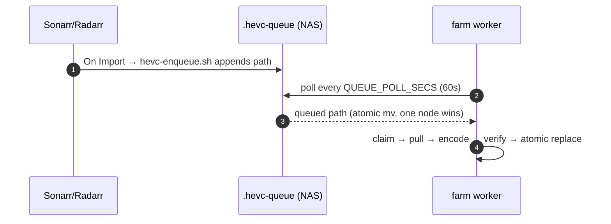
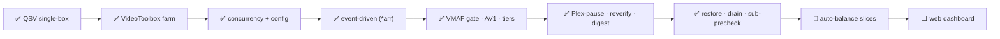

<div align="center">

# 🎬 mediaoptimizer

### Shrink your whole media library to HEVC — on one box, or across a whole fleet of Macs 🚀


*Re-encode H.264 → HEVC at ~**70% smaller**, **verify before replacing**, never touch what's already lean — and fan the work out across every idle Apple Silicon media engine you own.*

</div>

> [!NOTE]
> **Honest status:** this runs in production on the author's fleet (TrueNAS + 4 Apple Silicon Macs), clearing a ~3,000-episode library. It's a set of focused, battle-tested **bash scripts**, not a packaged app — you wire it to *your* NAS + nodes via one config file. No secrets ship in the repo; copy `farm.conf.example` → `farm.conf` (gitignored) and go.

---

## 🗺️ Table of Contents

| | | |
|---|---|---|
| 🤔 [Why](#why) | 🧠 [Core Concepts](#core-concepts) | 🏗️ [Architecture](#architecture) |
| 🔄 [How It Works](#how-it-works) | 🛡️ [Safety Model](#safety-model) | 🎛️ [Two Ways to Run](#two-ways-to-run) |
| ⚡ [Quick Start](#quick-start) | 🧰 [CLI & Config](#cli-config) | 📊 [Benchmarks](#benchmarks) |
| 🧪 [Cross-Platform](#cross-platform) | 🗺️ [Roadmap](#roadmap) | 🤝 [Contributing](#contributing) |

---

## 🤔 Why

You've got terabytes of H.264 and a pile of Apple Silicon with **dedicated media engines sitting idle** (they don't even compete with your GPU/ML work). Meanwhile most "transcode everything" tools either hammer one box, re-encode stuff that's already small, or replace originals with zero verification. 😬

| | 🎬 mediaoptimizer | 🐌 naive `for f in *; ffmpeg` | 🖥️ single-box transcoder |
|---|:---:|:---:|:---:|
| Skips already-HEVC / HDR / low-bitrate | ✅ | ❌ | ⚠️ sometimes |
| **Verifies** output before replacing | ✅ codec + duration | ❌ | ⚠️ rarely |
| Recoverable rolling trash (FIFO) | ✅ | ❌ | ⚠️ |
| Resumable (shared state, dedup) | ✅ | ❌ | ⚠️ |
| Fan out across many machines | ✅ N nodes | ❌ | ❌ |
| Uses idle Apple Silicon media engines | ✅ VideoToolbox | ❌ | ❌ |
| Survives reboot / crash | ✅ launchd `KeepAlive` | ❌ | ⚠️ |

---

## 🧠 Core Concepts



---

## 🏗️ Architecture

Two file homes, one shared brain. The **NAS** holds the library + the shared state file + a tiny persistent `ffmpeg` container for fast probing. Each **node** owns a disjoint slice and does the heavy lifting on its own media engine.



> 💡 **Single-box mode** drops the fleet entirely: one Docker container on the NAS encodes in place with the Intel iGPU (QSV). Same brain, no ssh.

---

## 🔄 How It Works

Each file flows through the same pipeline — but the farm **probes remotely first** so it only ever pulls files it's actually going to convert (no wasting bandwidth pulling a 2 GB file just to learn it's already HEVC).



---

## 🛡️ Safety Model

Originals are precious. Nothing gets replaced unless the new file is **provably good**.

| Guard | What it does |
|---|---|
| 🔍 **Verify** | Output must be HEVC **and** within 1% of source duration, or the replace is aborted |
| 📉 **Min-gain** | If the HEVC isn't at least `MIN_GAIN_PCT` smaller, the original is kept |
| 🗑️ **Rolling trash** | Replaced originals go to a size-capped (`TRASH_CAP_GB`) trash in the **same dataset** → the swap is an instant atomic rename, and recent originals stay recoverable (FIFO by insertion time) |
| 🧊 **Atomic** | `mv` within one dataset — never a half-written file at the real path |
| 🔒 **Single instance** | `flock` (Linux) / atomic `mkdir`+PID lock (macOS) per node |
| 🧮 **Free-space floor** | Single-box mode pauses if the pool drops below `MIN_FREE_GB` |
| ♻️ **Restore** | 🆕 `hevcctl restore <path>` pulls an original back out of the rolling trash — one-command undo of a bad conversion |
| 💬 **Subtitle pre-check** | 🆕 An `ffprobe` check skips the **doomed first encode** when image subs (PGS/DVD/DVB) can't fit the target container — goes straight to the `-sn` pass instead of burning a full failed attempt |

---

## 🎛️ Two Ways to Run

<table>
<tr><th>🖥️ Single box (QSV)</th><th>🌐 Distributed (VideoToolbox)</th></tr>
<tr><td>

`hevc-convert.sh` in a Docker `ffmpeg` container, encoding **in place** with an Intel iGPU. Gentle: niced, sleeps between files, pauses while Plex transcodes.

Managed by **`hevcctl.sh`**.

</td><td>

`farm-worker.sh` on each Apple Silicon Mac — pulls over ssh, encodes with **VideoToolbox**, pushes back, replaces on the NAS. N nodes × concurrency.

Deployed by **`farm-deploy.sh`** + **`farm.conf`**.

</td></tr>
</table>

> 🧬 Both share the **same `hevc-convert.sh` core** (cross-platform: `ENCODER=qsv|videotoolbox`, BSD/GNU shims, portable lock). The farm worker is a thin ssh transport around that same decide/encode/verify logic.

---

## ⚡ Quick Start

### 🌐 The farm (Apple Silicon nodes + a NAS)

**Prereqs:** each node has `bash 5+` & `ffmpeg` (with `hevc_videotoolbox`) via Homebrew, passwordless `ssh` to the NAS, and passwordless `sudo` for the probe container. The NAS runs a persistent probe container (see below).

```bash
# 0. on the NAS — start the persistent probe container (one time)
docker run -d --name hevc-probe --restart unless-stopped \
  -v /srv/media:/media --entrypoint sleep \
  lscr.io/linuxserver/ffmpeg:latest infinity

# 1. configure
git clone <your-fork> mediaoptimizer && cd mediaoptimizer/scripts
cp farm.conf.example farm.conf
$EDITOR farm.conf          # nodes, slices, NAS host, paths

# 2. sanity-check the config, then deploy auto-restarting daemons to every node
./farm-deploy.sh check     # 🆕 lint: NAS path, hosts reachable, slices disjoint
./farm-deploy.sh           # all nodes
./farm-deploy.sh status    # pulse check
```

### 🔔 Event-driven — convert on import (`*arr`)

Stop waiting for the hourly rescan. Point Sonarr/Radarr at `hevc-enqueue.sh` and new media converts within ~60s:

> **Settings → Connect → + → Custom Script** · Path: `hevc-enqueue.sh` · Triggers: **On Import** + **On Upgrade**

```bash
# *arr runs the script inside its container, so map its path to the NAS-host path the workers pull:
#   QUEUE_FILE=/tv/.hevc-queue   PATH_MAP=/tv=/mnt/tank/media/videos/TV
# Test it by hand:
./hevc-enqueue.sh /mnt/tank/media/videos/TV/Show/S01E01.mkv   # -> appended to .hevc-queue
```



### 🖥️ Single box (Intel QSV, in Docker)

```bash
MEDIA_DIR=/srv/media WORKDIR=/srv/hevc ./hevcctl.sh start
./hevcctl.sh status
```

---

## 🧰 CLI & Config

### `farm-deploy.sh`

| Command | Does |
|---|---|
| `./farm-deploy.sh` | Deploy worker + launchd daemon to **all** nodes |
| `./farm-deploy.sh <host>` | Deploy to one node |
| `./farm-deploy.sh check` | 🆕 Lint `farm.conf` — NAS path, host reachability, **disjoint** slices, numeric CONC, **+ missing-key drift vs `farm.conf.example`**. Run before deploy. |
| `./farm-deploy.sh status` | Daemon state + recent log per node **· in-flight claim count · `hevc-probe` container state** |
| `./farm-deploy.sh drain` | 🆕 **Graceful stop** — drop a `.drain` flag on every node; each worker finishes its **current** file then exits cleanly (no wasted half-encode). The next deploy clears the flag. |
| `./farm-deploy.sh failed` · `retry` | 🆕 Tally failed files by reason · clear them from shared state so the next scan re-attempts |
| `./farm-deploy.sh reverify` | 🆕 Sample-decode already-converted files (`REVERIFY_SAMPLE`) to catch silent corruption — originals are gone, so it alerts |
| `./farm-deploy.sh kick` · `stop` | Force-restart all daemons · bootout all daemons |
| `./farm-watchdog.sh` | 🆕 Self-heal: re-bootstrap any node whose launchd job isn't `running`, ntfy alert + dead-man heartbeat. Cron every ~10 min. |

### `hevcctl.sh`

| Command | Does |
|---|---|
| `start` / `stop` / `restart` | Manage the single-box QSV container |
| `status` · `savings` | Progress tally + pool free · lifetime size-saved from the durable ledger |
| `failed` · `retry` | 🆕 List failures by reason · restart with `RETRY_FAILED=1` |
| `restore <path>` | 🆕 ♻️ **Undo a bad conversion** — pull the original back from `.hevc_trash` (newest match) and overwrite the converted file |
| `logs [N]` · `stats` | Tail the log · live container stats |

### 🛠️ Standalone helpers

| Command | Does |
|---|---|
| `./scripts/hevc-estimate.sh <root>` | 🆕 **Dry run** — probe + classify a library and project total reclaim before you convert (`EST_RATIO`) |
| `./scripts/hevc-digest.sh` | 🆕 Daily savings digest (last `SINCE_HOURS`) → ntfy or stdout. Cron it. |
| `./scripts/vmaf-sample.sh <files…>` | 🆕 Measure mean VMAF of a few sample encodes so you can set `VMAF_MIN` from data, not a guess |
| `./install.sh` | 🆕 Symlink `hevcctl`/`farm-deploy` onto `PATH` + seed `farm.conf` (no brew tap needed) |
| `./scripts/test.sh` | 🆕 Zero-dep regression gate: `bash -n` every script + lib/enqueue/estimate/digest selfchecks |

### 🎚️ Worker behavior knobs (optional, all default to no-op)

| Env | Effect |
|---|---|
| `PLEX_PAUSE=1` + `PLEX_TOKEN` | Farm waits while Plex has a live transcode (`MAX_PLEX_WAIT_MIN` cap) |
| `ARR_URL` + `ARR_KEY` (`ARR_KIND=sonarr\|radarr`) | After a pass replaces a file, tell \*arr to re-read it (debounced 1/pass) |
| `SPACE_GUARD=1` *(default on)* | Skip a file if the worker's local disk can't hold ~2.2× its size |
| `EXCLUDE` | Newline globs the farm never touches (keep a grain master untouched) |

### `farm.conf` (sourced; the only place your real values live — gitignored)

| Key | Meaning |
|---|---|
| `HOSTS` | Array of node ssh hosts |
| `SLICE[host]` | **Disjoint** newline-separated library subdirs per node |
| `CONC[host]` | Concurrent encodes per node (Ultra ≈ 3, Max/laptop ≈ 2) |
| `NAS` · `REMOTE_ROOT` · `STATE_REMOTE` | File server host, library root, shared state path |
| `PROBE_CTR` · `MEDIA_HOST` · `MEDIA_CANON` | Probe container + host→container path remap |
| `NODE_USER` · `NODE_DIR` · `NODE_BASH` · `LABEL` | Per-node daemon identity & install paths |

<details>
<summary>🎚️ Tuning knobs (env, both modes)</summary>

| Var | Default | Meaning |
|---|---|---|
| `VT_QUALITY` | `60` | VideoToolbox `-q:v` (1–100) |
| `QUALITY` | `22` | QSV ICQ `global_quality` |
| `MAX_W`×`MAX_H` | `1920`×`1080` | Only-downscale ceiling |
| `MIN_SRC_KBPS` | `3000` | Skip sources already leaner |
| `MIN_GAIN_PCT` | `8` | Output must be this % smaller |
| `TRASH_CAP_GB` | `80` | Rolling trash cap per dataset |
| `CONCURRENCY` | `1` | Parallel encodes per worker |
| `DRY_RUN` · `LIMIT` · `ONESHOT` | `0` | Preview · cap files · one pass (great for testing) |

</details>

---

## 📊 Benchmarks

> Measured on the author's fleet: 2× M3 Ultra, 1× M1 Ultra, 1× M3 Max, feeding from a TrueNAS box. **Your mileage varies with NAS bandwidth & node count.**

| Metric | Result |
|---|---|
| 📉 Size reduction | **~70%** average (H.264 → HEVC, VMAF stays high) |
| 🍎 VideoToolbox speed | ~**36× realtime** on a 1080p segment (single stream) |
| 🌐 Fleet throughput | **~60–100 converts/hour** at 11 concurrent across 4 nodes |
| ⏱️ ~1,600-file backlog | days on one NAS iGPU → **under a day** on the farm |

> ⚖️ **Reality check:** 3× concurrency ≈ 1.5–2× throughput, not 3×. The ceiling is the *shared media engine per machine + NAS pull bandwidth*, not idle compute — so past ~3-per you just add contention.

---

## 🧪 Cross-Platform

| | 🖥️ Linux / Intel | 🍎 macOS / Apple Silicon |
|---|:---:|:---:|
| Encoder | `hevc_qsv` (ICQ) | `hevc_videotoolbox` (`-q:v`) |
| Lock | `flock` | atomic `mkdir` + PID |
| `stat` / `df` | GNU | BSD shims |
| Role | single-box, in-place | farm node, ssh pull/push |
| Deploy | Docker container | launchd daemon |

---

## 🗺️ Roadmap



| Status | Item |
|:---:|---|
| ✅ | Single-box QSV converter (Docker, in-place, verified) |
| ✅ | Distributed VideoToolbox farm (ssh pull/push, atomic replace) |
| ✅ | Remote-probe optimization (no pull-to-skip) |
| ✅ | Per-node concurrency + externalized `farm.conf` |
| ✅ | launchd auto-restart daemons (survives reboot/crash) |
| ✅ | HDR / Dolby Vision auto-skip (never flattens a master) |
| ✅ | **Event-driven convert** — `*arr` On Import → `hevc-enqueue.sh` → ~60s latency |
| ✅ | **Perceptual quality gate** — opt-in VMAF floor (`VMAF_MIN`) before replacing originals |
| ✅ | **AV1 opt-in** (`VT_CODEC=av1`) with per-box capability probe + HEVC fallback |
| ✅ | Self-healing `farm-watchdog.sh` (re-bootstrap dead nodes + ntfy + dead-man heartbeat) |
| ✅ | **Plex-pause for farm workers** + `*arr` refresh-after-replace + pre-pull space guard + path excludes |
| ✅ | **Re-verify sweep** (`farm-deploy reverify`) — spot-decode converted files for silent corruption |
| ✅ | **Savings digest** (`hevc-digest.sh`) + **dry-run estimator** (`hevc-estimate.sh`) + VMAF baseline sampler |
| ✅ | Per-resolution quality tiers · `farm-deploy check`/`retry` · `test.sh` · `install.sh` |
| ✅ | **One-command undo** (`hevcctl restore`) · **graceful `farm-deploy drain`** · subtitle pre-check · per-file failure stderr · conf-drift lint · claims/probe in status |
| 🔨 | Auto-balance slices by measured node throughput |
| ⬜ | Web dashboard / live progress UI |
| ⬜ | Optional NFS/SMB transport where the OS cooperates |

---

## 🤝 Contributing

PRs welcome! Keep it **bash-portable** (works under the Linux/macOS shims), and never let a doc lie about the code. Before any change to behavior, run a `DRY_RUN=1 LIMIT=1` pass against a test slice.

> 📜 **License:** [Apache 2.0](LICENSE) — permissive, patent-grant included. Use it, fork it, ship it.

---

<div align="center">

### 🍿 Point it at your library, walk away, come back to half the disk usage.

*Built for hoarders with too many Macs and not enough SSD.* 💾✨

</div>
